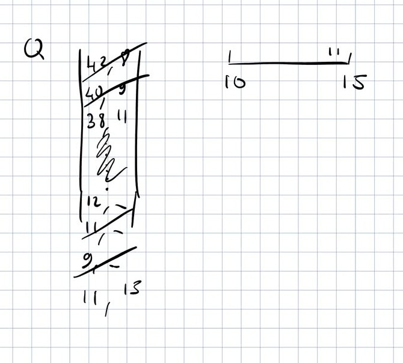
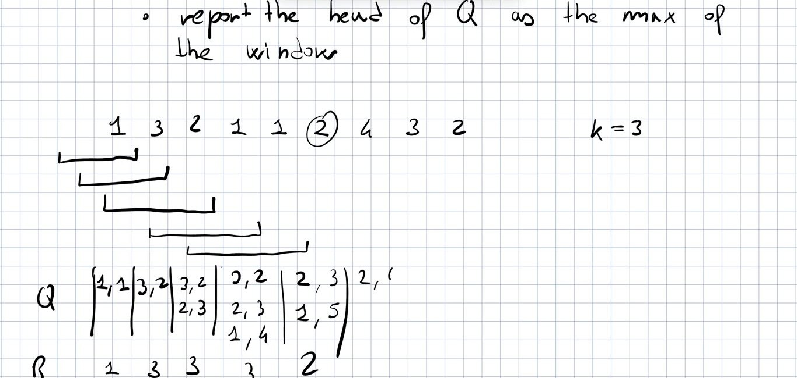
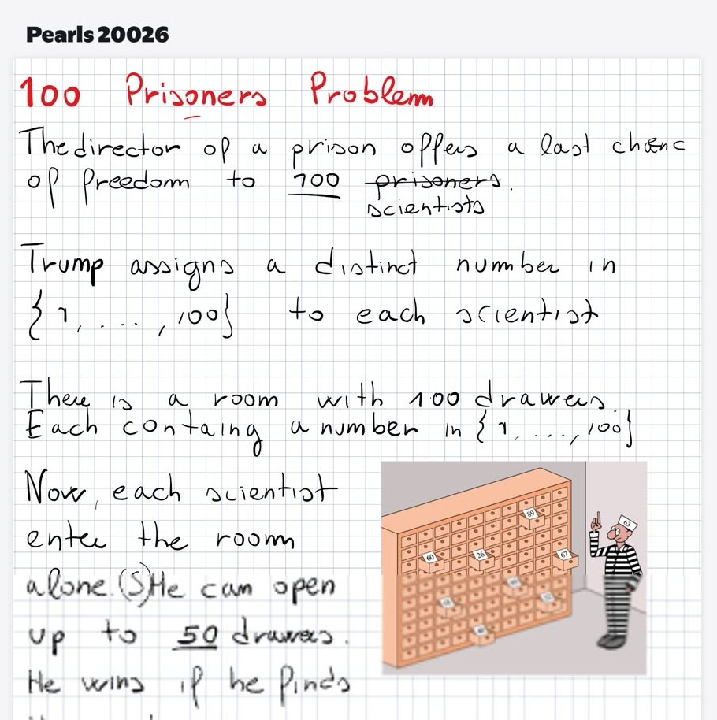
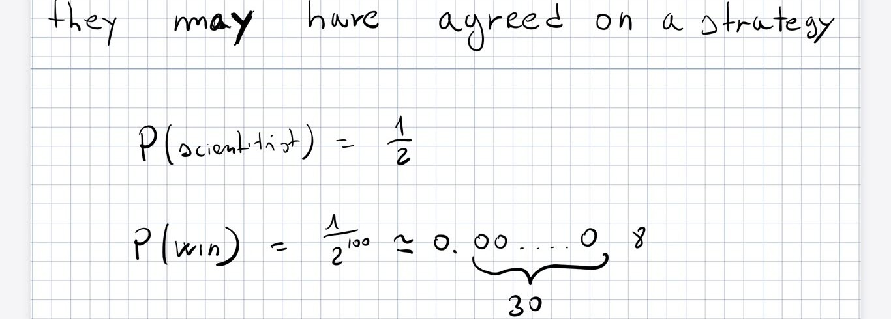

# CPC — Lecture 3

Versione markdown di `L3.pdf` (generata dal .tex). Il PDF è la versione di riferimento.

> **Sources.** Recording `L_03.mp4` (1h43m): automatic transcript + frames of the professor’s iPad notes (the handwritten images in this document are *his* board). The professor’s notebook for this part (`SlidingWindowMaxima.pdf`, 11 pages: Trapping Rain Water, SWM from L2 to L3, “is a binary tree a BST?”) is in this folder; its pages replace the video frames where they cover the same content. Rust code of the SWM: Prof. Rossano’s note <https://pages.di.unipi.it/rossano/blog/2023/swm/>. Parts marked \[extra\] are *not* from the lecture (my additions: plots, proofs completed, code).

Code: `Lessons/L3/src/lib.rs` — `cargo test -p l3`, `cargo run -p l3 –release –bin swm`, `cargo run -p l3 –release –bin prisoners`.

# Recap of L2 and the method

- Trivial solution $\Theta(nk)$: each window is recomputed from scratch although only one element enters and one leaves.

- Each step needs three operations on a *multiset* (the window): **remove** an element, **insert** an element, **report the max**. The trivial solution is just a trivial data structure for them.

- **Heap + lazy delete**: store pairs $\langle$value, position$\rangle$; remove an element only when it is the max and lies outside the window. $\#\text{insertions}=n$, $\#\text{extractions}\le n$ (each element removed at most once) $\Rightarrow \Theta(n\log n)$. *“Being lazy is something we are going to do often, because it simplifies things.”*

- **BST** (predecessor problem: insert, delete, search, min/max, successor, predecessor in $\Theta(\log|S|)$) storing only the window $\Rightarrow \Theta(n\log k)$.

> **Method:** trivial solution $\to$ isolate the operations it needs $\to$ find a data structure supporting them. $\Theta(n\log k)$ is enough in most practical cases (and probably in interviews), but it is not optimal: the optimum is $\Theta(n)$, since the whole array must be read at least once.

# Sliding Window Maxima in $\Theta(n)$

## The deque, and how it is implemented

A **deque** (double-ended queue) allows access, insertion and deletion at both **head** and **tail** in $O(1)$ (amortized). Every language has one (Rust: `VecDeque`). Possible implementations:

- **circular array** with a head and a tail pointer — requires knowing the maximum size in advance;

- **linked list** — works in $O(1)$ for these operations, but “in real life nobody uses a list”. Four inefficiencies:

  1.  an allocation/deallocation for every insertion/deletion (expensive);

  2.  scanning is cache-unfriendly (you jump around memory), while scanning an array is very fast;

  3.  no random access;

  4.  extra space for the pointers: with small keys you roughly double the space.

  (Python “lists” are actually arrays.)

- **list of blocks**: each node is a fixed-size block of elements. Allocations only when a block is full/empty, jumps during a scan are only $\#\text{elements}/\text{block size}$, and the pointer cost is amortized over the block. This is how deques are usually implemented.

## Algorithm

Keep a deque $Q$ of pairs $\langle e,p\rangle$ (value, position) — the position tells us whether an element is still in the window. (Prof. notes p.9) Repeat $n$ times:

1.  move the window one position to the right; let $y$ be the new element;

2.  **head**: remove from the head of $Q$ the elements outside the window; **stop** as soon as the current head is inside the window (lazy: elements outside the window may remain in the middle of $Q$, we don’t scan it all);

3.  **tail**: insert $y$ from the tail, removing every element $\le y$; **stop** as soon as the tail is $>y$;

4.  report the head of $Q$ as the max of the window.

Intuition example from the board: window = positions $10..15$, new element $11$ at position 15. From the head, $\langle 42,8\rangle$ and $\langle 40,9\rangle$ are outside $\Rightarrow$ removed; $\langle 38,11\rangle$ is inside $\Rightarrow$ stop (whatever is in the middle is not touched). From the tail, the elements $\le 11$ are removed, then $\langle 11,15\rangle$ is appended. \

The prof also remarked that such an “almost English” description is precise enough to be used directly as a prompt to generate working code.

## Running example

Array used in class (modified on the board so that values and positions differ): $A=[1,3,2,1,1,2,4,3,2]$, $k=3$, positions from 1. The window starts “before” the array, so the first $k-1$ reported values refer to partial windows (skip them if you don’t consider them valid). \ Board: $R = 1,3,3,3,2$ (then $2$). Note the step at $p=5$: the new $1$ *kills* the old $\langle1,4\rangle$ because the removal condition is $\le$. The two final $2$’s are different elements: the first is the max of the window $[2,1,1]$, the second the max of $[1,1,2]$.

<figure>
<embed src="figs/deque_trace.pdf" />
<figcaption>[extra] Full trace (the board stopped at <em>p</em> = 6). Full windows: 3, 3, 2, 2, 4, 4, 4.</figcaption>
</figure>

## Time complexity

Running time $\propto$ \#iterations + \#removals from head + \#removals from tail. Every element is pushed exactly once and removed at most once (same argument as the lazy heap): $$\#\text{removes} + \#\text{pushes} \;\le\; n + n = 2n \text{ operations, each } O(1) \;\Rightarrow\; \Theta(n).$$

## Correctness

#### Property 1.

$Q$ is sorted in decreasing order.

*Proof (by contradiction, as in class).* Assume $Q$ is not sorted: then there are two consecutive elements $\langle x,p_x\rangle$ (closer to the head) and $\langle y,p_y\rangle$ with $x\le y$.

- $p_x>p_y$: in $A$ we have $y$ before $x$. Impossible: insertions happen at the tail, so $x$ (inserted later) would be behind $y$, not before it.

- $p_x<p_y$: $x$ comes first in $A$. When $y$ was inserted from the tail, it found $x$ immediately above it and, since $x\le y$, it would have killed it.

Both cases are impossible $\Rightarrow Q$ is sorted. (A student gave the equivalent inductive argument: each new element stops right below a larger one.) $\square$ (Prof. notes p.10)

#### Definition.

An element is a **right leader** (RL) iff it is greater than any element on its right (in the window). Example: in $4\,2\,3\,1\,1$ the RLs are $4$, $3$ and the last $1$ (the first $1$ is not: another $1$ follows it; the last element is always an RL). The maximum of the window is always an RL.

#### Property 2.

At every iteration $Q$ contains **all and only** the right leaders of the window.

*Proof.*

1.  **All**: an RL cannot be killed by any of the next elements, because they are all smaller.

2.  **Only**: the head $a$ is in the window (step 2 of the algorithm). Could there be, further down in $Q$, an element $b$ outside the window? Then $b$ comes before $a$ in the array, so the insertion of $a$, which happened after $b$, would have killed $b$ from the tail ($b$ is below $a$ in the sorted $Q$, so $b\le a$). $\square$

(Prof. notes p.11) The proof in class covers the elements outside the window; for elements *inside* the window that are not RLs: such an element has a larger (or equal) element to its right, whose later insertion killed it.

> The max of the window is an RL $\Rightarrow$ it is in $Q$; $Q$ is sorted $\Rightarrow$ it is the head. The reported element is the maximum. Note: “all” alone would already imply that the maximum is in $Q$ and, since the head is cleaned by step 2, on top.

## Code (Prof. Rossano, from the note)

    use std::collections::VecDeque;

    fn linear(nums: &Vec<i32>, k: usize) -> Vec<i32> {
        let n = nums.len();
        if k > n {
            return Vec::<i32>::new();
        }

        let mut q: VecDeque<usize> = VecDeque::new();
        let mut maxs: Vec<i32> = Vec::with_capacity(n - k + 1);

        for i in 0..k {
            while (!q.is_empty()) && nums[i] > nums[*q.back().unwrap()] {
                q.pop_back();
            }
            q.push_back(i);
        }
        maxs.push(nums[*q.front().unwrap()]);

        for i in k..n {
            while !q.is_empty() && q.front().unwrap() + k <= i {
                q.pop_front();
            }

            while (!q.is_empty()) && nums[i] > nums[*q.back().unwrap()] {
                q.pop_back();
            }
            q.push_back(i);
            maxs.push(nums[*q.front().unwrap()]);
        }
        maxs
    }

Differences from the board version: the code stores only positions (the value is `nums[p]`), reports only full windows, and removes from the tail only elements *strictly* smaller (`>`), so equal values stay in $Q$ (then $Q$ is non-increasing and may contain equal non-RLs; still correct, the head is a maximum). The board version (pairs, $\le$, partial windows) is in `extra::linear_lecture`\[extra\].

#### Exercise suggested by the prof.

Implement all three solutions in Rust (good practice with the standard library: `BTreeSet`, `BinaryHeap`, `VecDeque`) and **benchmark** them, varying $n$ and $k$ and also on *adversarial* arrays, to see which is fastest in practice. \[extra\] One run of `cargo run -p l3 –release –bin swm` ($n=10^6$ random values, cloud machine, only indicative):

|             | $k=10$ | $k=1000$ |
|:------------|-------:|---------:|
| brute force |  10 ms |   394 ms |
| BST         |  67 ms |   153 ms |
| heap        | 106 ms |    40 ms |
| deque       |  14 ms |    19 ms |

Adversarial ideas to try: an increasing array (the heap never removes anything lazily until the end — it grows to $n$), a decreasing array (the deque keeps $k$ elements).

## \[extra\] Related exercise: Next Larger Element

For each $A[i]$, find the first strictly larger element to its right. Same “kill the dominated elements” idea with a stack of positions waiting for their answer: when $A[i]$ arrives it is the answer for every smaller element on top of the stack. $\Theta(n)$ (`extra::next_larger`).

# Trapping Rain Water

## Problem

The second problem of L1. An array $H$ is an elevation map: $H[i]$ is the height of a wall at position $i$. It rains; how many unit squares of water are trapped? Example from class: $H=[6,2,0,4,0,1,0,5,0,3]$.

<figure>
<embed src="figs/trw.pdf" />
<figcaption>[extra] The example with the trapped water; total 26. <em>M</em><em>R</em> = max on the right (inclusive).</figcaption>
</figure>

## Discussion in class

After a 10-minute break to think, several solutions were proposed by students:

- *Area estimation + two pointers*: estimate the area between two walls as (distance $\times$ lower height) and lazily subtract the walls met while moving the lower side. The prof found a problem by *mirroring* the map: if the tallest wall ($6$) is at the end where you start, you keep moving and never find a higher wall on the other side. Lesson: check a solution on the reversed input too.

- *Two pointers moving the side with the smaller max*: seemed to work on the example (it is the standard $O(1)$-space solution, see below).

- *Right leaders*: the positions where $MR$ changes are the right leaders ($6,5,3$ here); the water between two consecutive ones can be computed at once.

## The professor’s solution

Think *locally*: how much water stands on top of position $i$? $$\boxed{\;w_i = \min\big(\max A[1..i-1],\ \max A[i+1..n]\big) - H[i]\;}
\qquad (\text{clamped at } 0)$$ E.g. on the circled $1$: max on the left $6$, on the right $5$ $\Rightarrow$ $\min=5$, water $=5-1=4$. (Prof. notes p.1) In his notes the prof precomputes *both* arrays, $maxS$ (max of the suffix) and $maxP$ (max of the prefix); in class he said it is enough to:

- precompute one of the two, e.g. $MR[i]$ (max on the right) with a scan from right to left;

- scan from left to right keeping the max seen so far; add $\min(\text{max so far}, MR[i]) - H[i]$.

$\Theta(n)$ time, $\Theta(n)$ extra space (`trw::prefix_max`\[extra\]). *“If a solution with no extra space exists, for sure it’s better than this”* — so the two-pointer solution is probably the best.

#### \[extra\] Why two pointers work in $O(1)$ space

(`trw::two_pointers`). Keep $l, r$ and the maxima $ML=\max H[..l]$, $MR=\max H[r..]$. If $ML\le MR$, the water on $l$ is exactly $ML-H[l]$: its right max is at least $MR\ge ML$, so the minimum is $ML$. Advance $l$. Symmetric otherwise. Tested against brute force on random inputs.

#### Homework.

Think about the proposed solutions, look for bugs or prove them correct. The prof asked to send him (by email) a **short English description** of your solution: next lecture he wants to try asking Claude to prove or disprove them.

# Next: “Pearls”

The next couple of lectures are about *pearls*: solutions to problems that at first seem impossible, which turn out to be super clever, elegant and simple — in particular solutions using **constant extra space**. \[extra\] For a moment the screen showed last year’s notes on a related pearl: two pointers, *slow* (1 step) and *fast* (2 steps), on a *read-only* list, $O(1)$ extra space, finding the start of a cycle (Floyd). Probably one of the next topics.

# The 100 Prisoners Puzzle

One of the prof’s favourite puzzles, introduced by two researchers from Denmark who were trying to prove something and believed that nothing better than the trivial strategy existed. \[extra\] (Gál and Miltersen, 2003, according to Wikipedia.)

## Statement

\

- The director of a prison (“Trump”) offers a last chance of freedom to $100$ prisoners (scientists), each with a distinct number in $\{1,\dots,100\}$.

- A room has $100$ drawers, each containing a distinct number in $\{1,\dots,100\}$.

- Each scientist enters alone and opens up to $50$ drawers; he wins if he finds his own number. They are freed only if **all** win.

- No communication after the start, nothing can be moved, drawers are closed again. They may agree on a strategy beforehand.

## Random strategy

Each scientist opens 50 random drawers: $P(\text{scientist})=\tfrac12$, independently, so $P(\text{win}) = 1/2^{100} \approx 0.\underbrace{0\cdots0}_{30}8 \approx 7.9\cdot10^{-31}$. Essentially impossible. \ Surprisingly, a strategy with $P(\text{win})\approx 0.3$ exists.

## The strategy (found in class)

- Scientist $i$ opens the drawer numbered $i$; if it contains $j$, he opens drawer $j$ next, and so on.

- The drawers contain a **permutation**; he is walking along the **cycle** containing $i$. Since it is a permutation he always comes back: the number $i$ is the one pointing back to the starting drawer $i$.

- He wins iff his cycle has length $\le 50$.

- **Crucial point**: everybody in my cycle wins iff I win. Scientists no longer win independently: they win or lose *together*. All win iff the permutation has no cycle longer than $50$.

- The strategy is deterministic and the director chooses the permutation. To get randomness, the prisoners assign the **indexes of the drawers at random** (a secret random relabelling): this makes the permutation they follow random.

- Since there are $100$ numbers, a cycle longer than $50$, if present, is **unique**.

$P(\text{win}) = P(\text{a random permutation of 100 has no cycle longer than 50}) \approx 0.3$. *The proof (“a few lines of easy combinatorics”) was done at the beginning of L4: see `Lessons/L4/L4.pdf`.*

## The proof (summary, done in L4)

Let $n=2m$. Permutations with a cycle of length $\ell>m$: $\binom{n}{\ell}(\ell-1)!\,(n-\ell)! = n!/\ell$ (choose the elements, arrange them in a cycle, permute the rest). Such a cycle is unique, so there is no double counting: $P(\text{cycle of length }\ell)=1/\ell$ and $$P(\text{win}) = 1-\sum_{\ell=51}^{100}\frac1\ell = 1-(H_{100}-H_{50}) \approx 0.3118,
\qquad \lim_{n\to\infty} = 1-\ln 2\approx 0.3069 .$$

<figure>

<embed src="figs/perm_cycles.pdf" /> 
<embed src="figs/prisoners_prob.pdf" />

<figcaption>[extra] Cycles of a permutation (<em>n</em> = 10) and <em>P</em>(win) as <em>n</em> grows. Simulation with 105 permutations (<code>–bin prisoners</code>): 0.3131.</figcaption>
</figure>

# From the professor’s notes: is a binary tree a BST?

Pages 7–8 of `SlidingWindowMaxima.pdf` contain a problem that is **not** in the recording of L3 (probably discussed at the end of L2, as a follow-up of the BST digression; check your L2 notes). (Prof. notes p.7) **Wrong idea**: check only that for every node $v$, `v.left.key` $\le$ `v.key` $<$ `v.right.key`. Counterexample in the notes: root $10$, left child $5$, whose right child is $12$: every local check passes, but $12$ is in the left subtree of $10$. (Prof. notes p.8) **Correct recursion**: $P(v)$ returns (is it a BST?, min, max) of the subtree of $v$; `NULL` returns (true, $+\infty$, $-\infty$). $v$ is a BST iff both children are and $M_\ell \le \texttt{v.key} < m_r$ (max of the left subtree, min of the right one). One visit per node: $\Theta(n)$. \[extra\] Rust version in `extra::is_bst` (tested on the counterexample).
