# CPC — Lectures 4 and 5

Versione markdown di `L4.pdf` (in VS Code: anteprima con Cmd+Shift+V). Parte I = L4 dalla registrazione; Parte II = L5 **provvisoria**, dalle note 2025 del prof.

> **Sources.** Recording `L_04.MP4` (1h32m): Teams transcript (`L_04-en-US.docx`) + frames of the professor’s iPad notes (the handwritten images are *his* board). Prof.’s notes of last year on the same topics: `Pearls_2025.pdf` (in this folder), used for the parts marked \[extra\] and for the preview of the next lectures. Your `notes.md` and your `my_sol` were also used.

> **Where we are.** **Part I = L4 (28/09)**, from the recording: the prof stopped at §3.6 (“Does random access help? Destroying $A$”), the bug of the “destroy $A$” solution, left as homework.  
> **Part II = L5 (30/09), PROVISIONAL**: the recording is not available yet. It is reconstructed from the professor’s notes of last year (`Pearls_2025.pdf` p. 8–17): in 2025 these topics took the two “Tiny but Mighty” lectures right after the 100 prisoners puzzle, and so far 2026 has followed the 2025 schedule closely. What was really said on 30/09 may differ: it will be redone on the recording.  
> **Next (L6, 05/10)**: in 2025 the next lecture was *binary search and the two pointers trick* (<https://pages.di.unipi.it/rossano/blog/2023/binarysearch/>).

Code: `Lessons/L4/src/claude.rs` (your `lib.rs` is untouched apart from the line `pub mod claude;`) — `cargo test -p l4`.

# The 100 Prisoners puzzle: the proof

## Recap and strategy

100 prisoners, 100 drawers with a permutation of $1..100$, each opens at most 50 drawers; they are freed only if *all* find their number. Random strategy: $P=1/2^{100}$. The strategy found in L3:

- the **drawers are numbered too**: if the numbers inside are random, any numbering works (e.g. row-wise); otherwise the prisoners assign the numbers to the drawers *uniformly at random* — this is where randomness comes in;

- prisoner $i$ opens drawer $i$, finds $d_i$; if $d_i=i$ he wins, otherwise he opens drawer $d_i$ and continues.

**Observation**: if we do not stop after 50 steps, the prisoner is guaranteed to find his number (it is a permutation: he walks along a cycle and comes back to the start). \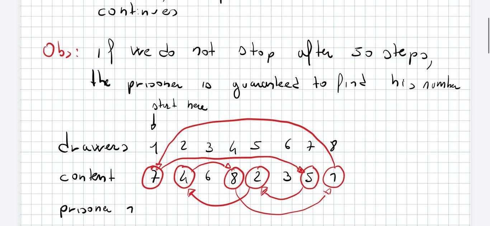 Example with 8 drawers, contents $7,4,6,8,2,3,5,1$: prisoner 1 visits $1\to7\to5\to2\to4\to8$ and finds $1$ in drawer $8$: he is closing the cycle. He wins iff his cycle has at most half of the drawers, and then everybody in that cycle wins with him. \[extra\] Here the cycles are $(1\,7\,5\,2\,4\,8)$ and $(3\,6)$: with 4 openings each, the six prisoners of the long cycle lose, so all lose.

$$P(\text{all win}) = P(\text{a random permutation has no cycle longer than } 50).$$

## Counting

Count the permutations of $100$ elements with a cycle of length $\ell>50$:

- since $\ell>50$ there is **only one** such cycle (it covers more than half of the elements) $\Rightarrow$ no double counting;

- choose the elements of the cycle: $\binom{100}{\ell}$;

- order them in the cycle: $\ell!$ orderings, but a cycle has no beginning, so each cycle is counted $\ell$ times (e.g. $\ell=3$, elements $3,5,42$: $3\,5\,42$, $5\,42\,3$, $42\,3\,5$ are the same cycle) $\Rightarrow (\ell-1)!$;

- order the remaining $100-\ell$ elements freely: $(100-\ell)!$.

$$\binom{100}{\ell}(\ell-1)!\,(100-\ell)! = \frac{100!}{\ell},\qquad
\sum_{\ell=51}^{100}\frac{100!}{\ell} = 100!\Big(\frac1{51}+\dots+\frac1{100}\Big) = 100!\,(H_{100}-H_{50})$$ with $H_n=1+\frac12+\dots+\frac1n$ the $n$-th harmonic number. Dividing by the $100!$ permutations:

> $P(\text{all win}) = 1-(H_{100}-H_{50}) \approx 0.3118$ (vs. $\approx 10^{-30}$ with the random strategy). \[extra\] For $n\to\infty$ it tends to $1-\ln 2\approx 0.307$; simulation in `Lessons/L3` (`–bin prisoners`): $0.313$.

\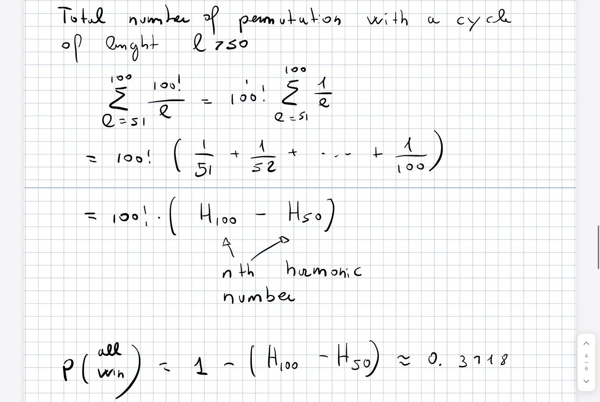 **Why it is exciting**: a problem that looks impossible to improve has a simple strategy that is $\sim 10^{29}$ times better, and the reason is also simple: the strategy *couples* the outcomes of the prisoners in the same cycle, and short cycles are not that unlikely.

#### \[extra\] From last year’s notes.

\(i\) A scientist does not need to choose the drawers beforehand: the strategy is *adaptive*. (ii) Why following the numbers always closes a cycle: in a permutation every drawer is pointed to by exactly one number, so a “$\rho$” shape (two arrows entering the same node) is impossible — it would require a *duplicated* number. Keep this picture in mind for the next problem. \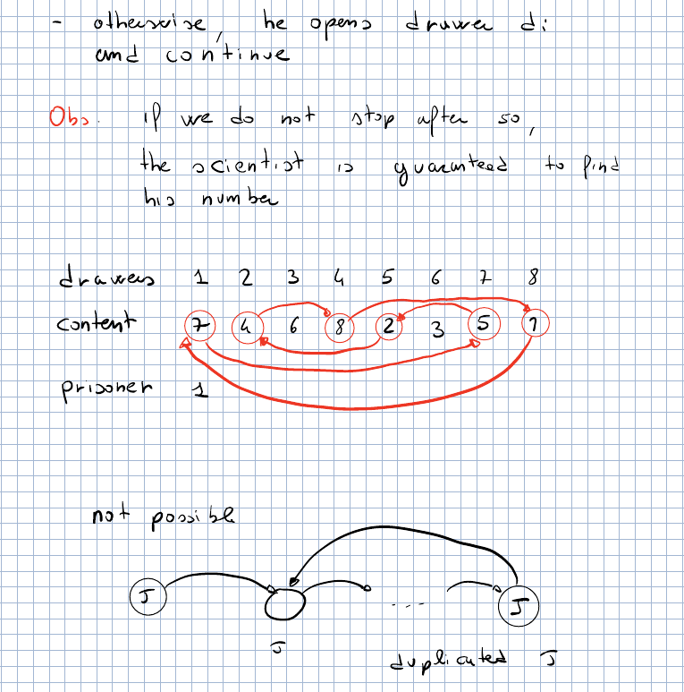

\*Prof. notes of last year, Pearls_2025.pdf p.3\*

# “Pearls” and the spirit of the course

The current series of lectures (started at the end of L3) are **pearls**: small, apparently simple problems with super cute, clever solutions; what we try to solve looks impossible, but an elegant and simple solution exists. The problems are connected: permutations and cycles from the puzzle will be useful for the next ones. In general the course presents *many small problems* per lecture; the focus is on the *techniques*.

# Duplicate element in an array

## Problem

\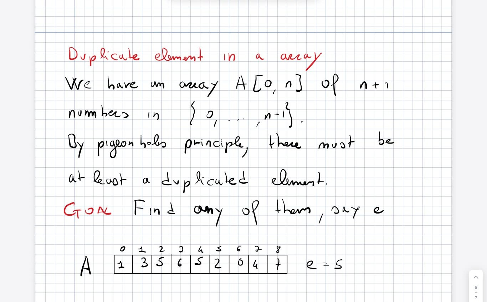 Given $A[0..n]$ with $n+1$ numbers in $\{0,\dots,n-1\}$, by the pigeonhole principle there is at least one duplicate. **Find any** duplicate $e$. Example: $A=[1,3,5,6,5,2,0,4,7]$ ($n=8$), $e=5$. (The prof noted he used 0-based indexing here, unlike the other problems, without a particular reason.)

## Solution 1: hash set

Scan $A$, add each element to a hash set $H$, stop as soon as the current element is already in $H$. $\Theta(n)$ time **with high probability** (hashing is randomized; an unlucky run is slower, and even a good hash function has some collisions, i.e. more than $n$ memory accesses), and $\Theta(n)$ extra space: to guarantee $O(1)$ operations w.h.p. the table must be $2$–$4\times$ the number of elements, it cannot be asymptotically smaller than $n$ (answer to a question in class).

#### A student’s idea that does not work.

Sum the array and subtract $0+1+\dots+(n-1)$: this works only if $A$ is a permutation plus one duplicate, but here any multiset is allowed (e.g. $5,5,5,5,\dots$).

## Solution 2: direct access table

Values are in $\{0,\dots,n-1\}$: replace $H$ with a **direct access table** (a bit vector $D$ of $n$ bits, all $0$; set $D[x]=1$ when $x$ is seen). Still $\Theta(n)$ time, but deterministic and *faster*: no hashing, direct access, the CPU can predict and prefetch. \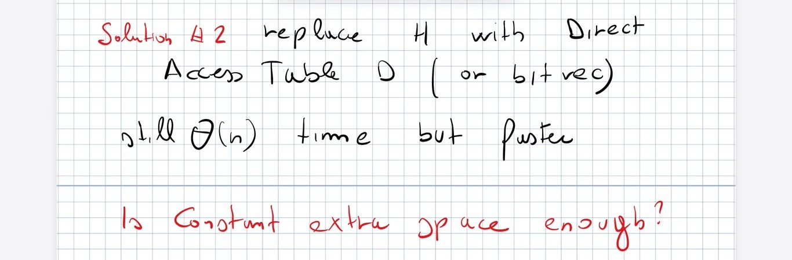

> Whenever you reach for a hash map (dictionary in Python, map in C++/Rust), ask: *do I really need it, or does my data allow a direct access table?* Hashing is usually taught the other way round: start from a direct access table as large as the largest value, then hash because the table is too big. If the table is small enough, there is no reason to pay for hashing and collisions.

## Constant extra space?

It seems impossible: we need to remember the elements seen so far. A student proposed to multiply, for each element $x$, an accumulator by the $x$-th prime, and factorize at the end: but the number can be as large as $\approx n!$, i.e. $\Theta(n\log n)$ bits — as much as the array itself. (If you can reconstruct the content of the array, you must use at least the space needed to represent it.) “Even incorrect solutions are nice.”

## Solution 3: $\Theta(\log n)$ passes, reconstruct $e$ bit by bit

Assume $n$ is a power of 2. Write the elements in binary and find the bits of $e$ from the most significant one, with one scan per bit.

- **Pass 1**: count zeros and ones of the most significant bit. Without the extra element we would have exactly half and half ($4$ numbers are $<4$, $4$ are $\ge4$); the duplicate unbalances them. Example: $4$ zeros, $5$ ones $\Rightarrow$ first bit of $e$ is $1$.

- **Wrong continuation**: repeat the same count on the 2nd and 3rd bit over the whole array. Counterexample built in class: put a $3$ in the first position, $A=[3,3,5,6,5,2,0,4,7]$: the per-bit majority gives $111=7$, which is not a duplicate.

- **Correct**: at each pass count only the elements that start with the prefix found so far. Why: the elements starting with $1$, minus $4$, form a smaller instance of the same problem (5 elements with values in $0..3$ $\Rightarrow$ a duplicate by pigeonhole). Example: pass 2 on $\{5,6,5,4,7\}$: $3$ zeros, $2$ ones $\Rightarrow 0$; pass 3 on $\{5,5,4\}$: $1$ zero, $2$ ones $\Rightarrow 1$; $e=101_2=5$.

\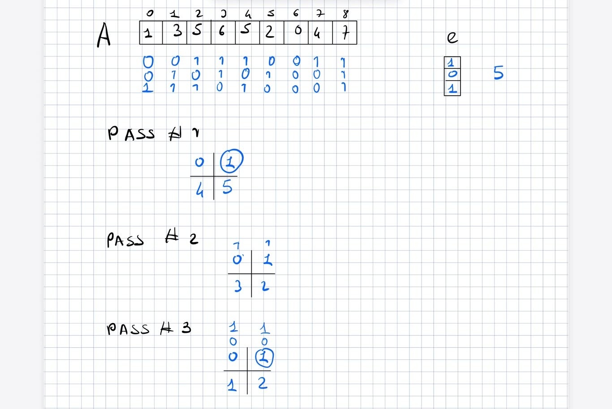

> $\Theta(n\log n)$ time, $O(1)$ extra space. It is the **best possible if no random access is allowed** (only left-to-right scans).

`claude::bit_by_bit` works for any $n$: it halves the *range of values* $[lo,hi)$ that surely contains a duplicate (if more than $mid-lo$ elements fall in $[lo,mid)$, a duplicate is there); with $n$ a power of 2 it is exactly the bit-by-bit counting. `claude::bits_majority_naive` is the wrong version, with the counterexample as a test.

## Does random access help? Destroying $A$

Can we get $\Theta(n)$ time *and* $O(1)$ extra space if random access is allowed? The prof first presented a “cheating” approach: we may **destroy $A$**, reusing its space.

- Idea from a student: do pass 1, so the most significant bit of $e$ is known. Then the most significant bit of every element is no longer needed: $n$ free bits, exactly what Solution 2 needs. Use them as the bit vector: to remember that $5$ was seen, set the MSB of $A[5]$ to $1$ (the number stored there no longer makes sense, but it was already accounted for). One more pass $\Rightarrow$ linear time.

- **The bug**: in the single pass we must consider only the elements whose MSB was $1$ and skip the others; but once the MSBs are overwritten, $1=001$ and $5=101$ have the same remaining bits and cannot be told apart.

- Attempts in class: negative numbers or a special marker for the elements to skip. Still not enough: with 2 remaining bits we have 4 values and would need $4+1$ symbols; e.g. using $00$ as the marker collides with $4=100$, which would look like a duplicate.

\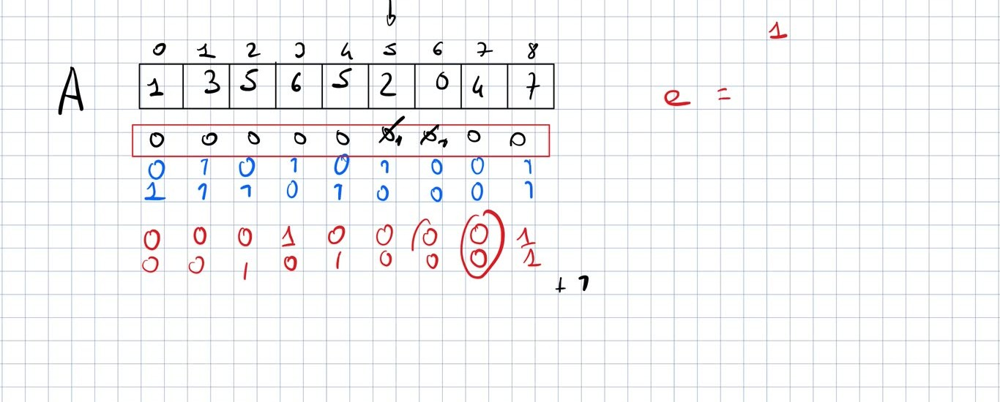

> **Homework**: fix the bug of this solution ($\Theta(n)$ time, $O(1)$ extra space, $A$ can be destroyed). The lecture ended here.

## \[extra\] Your solution `my_sol`

Your `my_sol` sends each value $v$ to cell $v$ by swapping, and stops when the cell $v$ already contains $v$. It destroys $A$, uses $O(1)$ extra space and runs in $\Theta(n)$: every swap puts one value in its final cell for good, so there are at most $n$ swaps overall (the `while` inside the `for` does not make it quadratic). It is a valid answer to “does random access help, if we may destroy $A$?”, different from the approach seen in class. Tests in `claude.rs`: 3000 random arrays checked against the definition, plus an adversarial input of size $2\cdot10^5$ (one big cycle). All pass.

# PART II — L5 (30/09/2026), PROVISIONAL (reconstructed from Pearls_2025.pdf, not from the lecture)

# Duplicate element: random access helps

## Destroying $A$, the 2025 way

\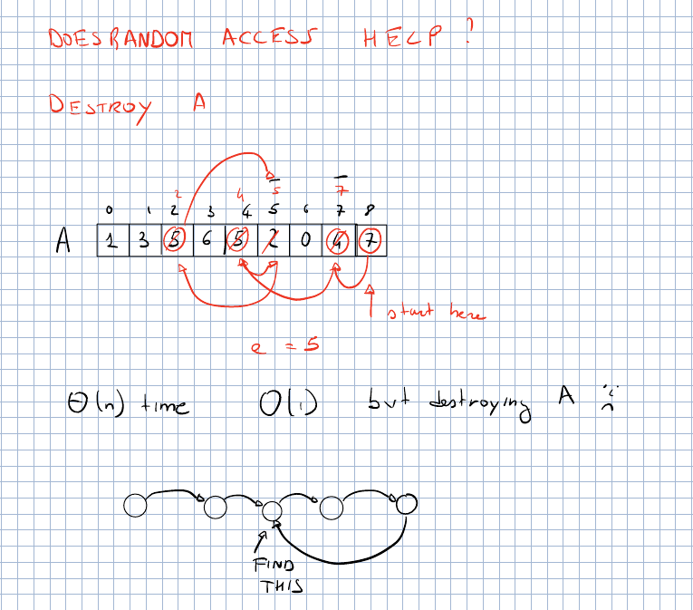

\*Prof. notes of last year, Pearls_2025.pdf p.8\* View $A$ as a **linked list**: cell $i$ points to cell $A[i]$. Start from position $n$: no cell points to $n$ (all values are $<n$), so following the pointers we never come back to $n$; since there are finitely many cells we end up in a **cycle** ($\rho$ shape). The node where the tail enters the cycle has *two* incoming arrows (one from the tail, one from the cycle): two cells contain its index, i.e. **it is a duplicated value** (the “not possible” picture of the 100 prisoners, now possible because of the duplicate). Example: $8\to7\to4\to5\to2\to5$: we reach cell $5$ twice, $e=5$.

> Mark every visited cell (destroying $A$); the first cell reached twice is a duplicate. $\Theta(n)$ time, $O(1)$ extra space, but $A$ is destroyed.

`claude::follow_pointers_destroy` marks a cell by writing $n$ into it ($n$ is not a valid value). Note: the 2026 lecture attacked “destroy $A$” differently (reusing the MSBs, with a bug): how the prof fixed it on 30/09 is not in the 2025 notes.

## Floyd’s cycle finding: $A$ read-only, $O(1)$ space

\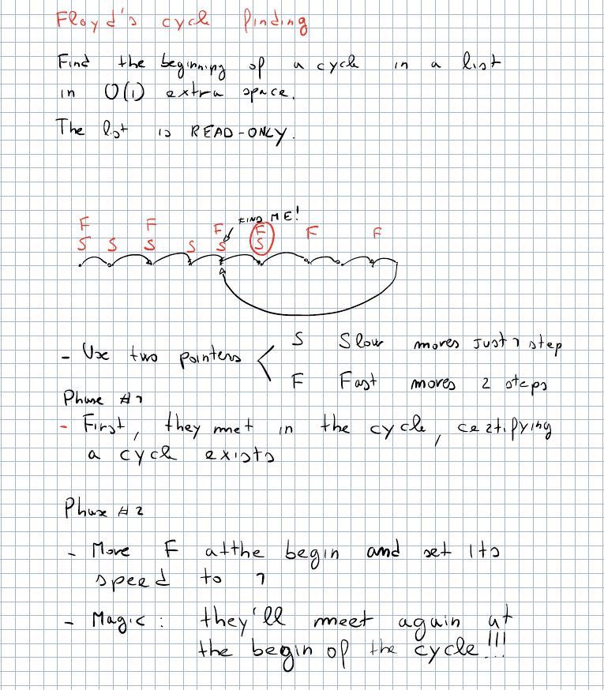

\*Prof. notes of last year, Pearls_2025.pdf p.9\* Find the beginning of the cycle in $O(1)$ extra space without modifying the list:

- two pointers from the start: **S**low moves 1 step, **F**ast moves 2 steps;

- **phase 1**: they meet inside the cycle (this certifies that a cycle exists);

- **phase 2**: move F back to the beginning and set its speed to 1; “magic”: they meet again **at the beginning of the cycle**.

\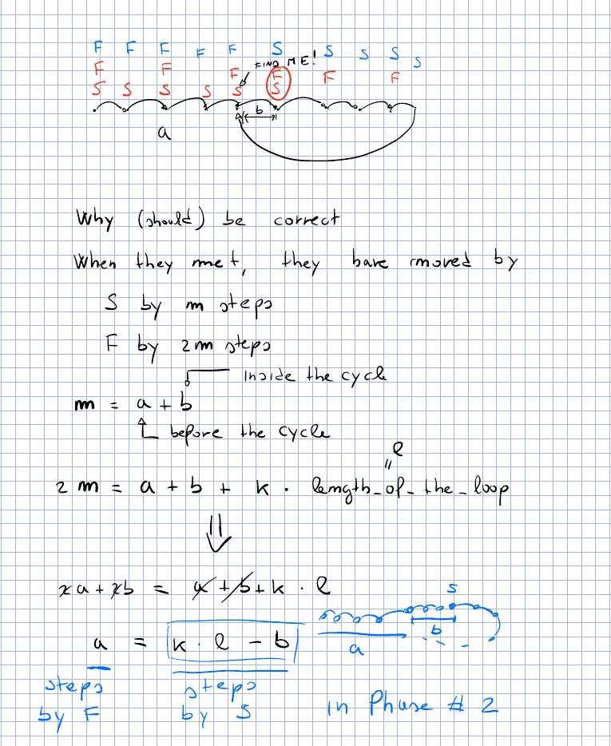

\*Prof. notes of last year, Pearls_2025.pdf p.10\* **Why.** When they meet, S has moved $m$ steps and F $2m$. With $a$ = length of the tail and $b$ = steps done by S inside the cycle, $m=a+b$, and F has done the same plus $k$ full loops of length $\ell$: $2m=a+b+k\ell$. Hence $2a+2b = a+b+k\ell$, i.e. $$a = k\ell - b.$$ In phase 2 F walks $a$ steps from the start and reaches the beginning of the cycle; in the same $a$ steps S, which was $b$ steps past the beginning, goes around to $b+k\ell-b \equiv 0$: the beginning of the cycle as well.

> Duplicate element with $A$ read-only: $\Theta(n)$ time, $O(1)$ extra space (random access needed). \[extra\] `claude::floyd`.

# Majority element

\

\*Prof. notes of last year, Pearls_2025.pdf p.12\* Given $A[1,n]$, find, if any, the element that occurs at least $\frac n2+1$ times. Sorting: $\Theta(n\log n)$ time; hash map: $\Theta(n)$ expected time, $\Theta(n)$ space. Is $\Theta(n)$ time and $O(1)$ space possible?

## Boyer–Moore algorithm

\

\*Prof. notes of last year, Pearls_2025.pdf p.13\* Keep a **candidate** $c$ and a **counter**; scan left to right: if $A[i]=c$ increase the counter, otherwise decrease it; if the counter becomes $0$, set $c=A[i]$ and the counter to $1$. \

\*Prof. notes of last year, Pearls_2025.pdf p.15\*

- Example $A=[5,3,1,1,2,3,1,1,1]$: at the end $c=1$, counter $3$. The counter is *not* the frequency of $1$ (which is $5$).

- **Claim**: if there is a majority element $e$, at the end $c=e$. **Why**: every decrement pairs one element with a different one and “kills” both; an occurrence of the majority element can kill another element, but there are more occurrences of $e$ than all the others together, so some occurrence of $e$ survives.

- If the majority is not guaranteed, $c$ can be anything (e.g. $[1,2,3]$): a second pass counting $c$ is needed. $\Theta(n)$ time, $O(1)$ space.

## Supporting insertions and deletions

\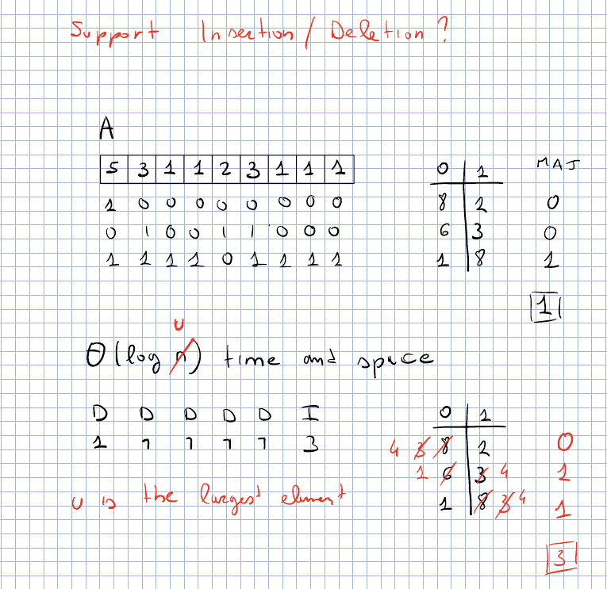

\*Prof. notes of last year, Pearls_2025.pdf p.14\* With a dynamic set, Boyer–Moore does not work (it cannot undo). Idea: for each **bit position** keep how many elements have a $0$ and how many a $1$; the majority element is in the majority in *every* bit, so its $i$-th bit is the most frequent value in position $i$. In the example: bits give $001=1$; after deleting five $1$’s and inserting a $3$ the counts give $011=3$. $O(\log u)$ time per operation and $O(\log u)$ space, with $u$ the largest element. \[extra\] `claude::BitMajority`.

# Misra–Gries heavy hitters

\

\*Prof. notes of last year, Pearls_2025.pdf p.16\* Generalization: find the elements that occur at least $\frac nT+1$ times (at most $T$ of them). Keep a set $K$ of at most $T$ candidates with counters: for each $e$, if $e\in K$ increase its counter, otherwise insert it with counter $1$; if now $|K|>T$, decrease *all* counters and delete the zeros. \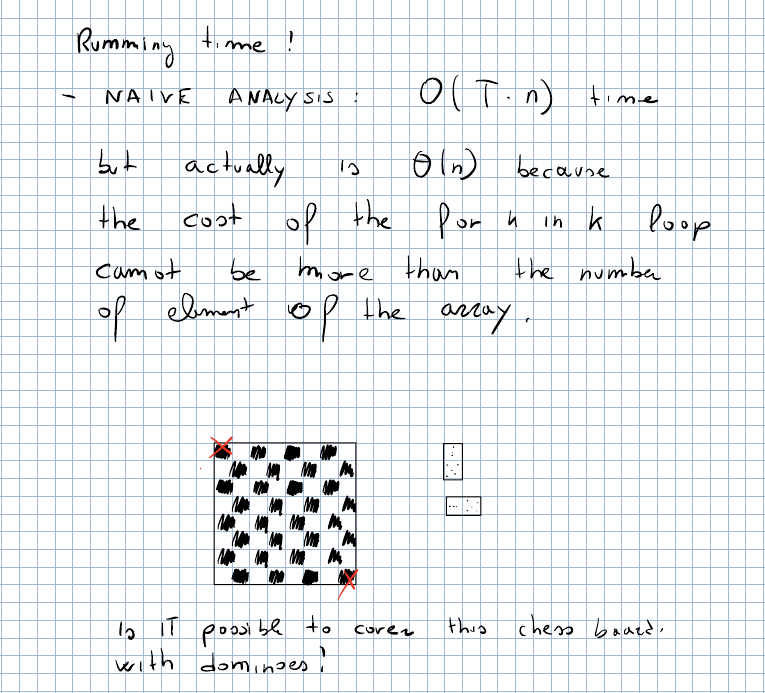

\*Prof. notes of last year, Pearls_2025.pdf p.17\* **Running time**: the naive analysis gives $O(T\cdot n)$, but it is $\Theta(n)$: the total cost of the “decrease all” loops cannot exceed the number of elements of the array (each decrement cancels a previous increment, and there are $n$ increments). With $T=2$ it is exactly the majority element problem. \[extra\] Candidates may include false positives: a second pass to count them gives the exact answer (`claude::misra_gries`, `claude::heavy_hitters`).

# Puzzle: dominoes on a chessboard

Page 17 ends with a puzzle: an $8\times8$ chessboard with two **opposite corners removed**: can it be covered with dominoes ($2\times1$)? Think about it before reading the footnote.[^1]

[^1]: \[extra\] No: each domino covers one black and one white square, but the two removed corners have the same colour, so 30 squares of one colour and 32 of the other remain.
