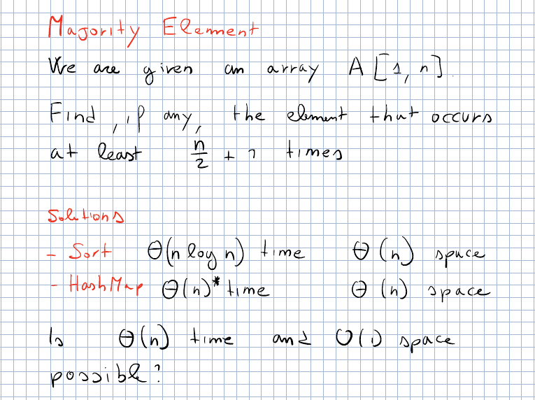
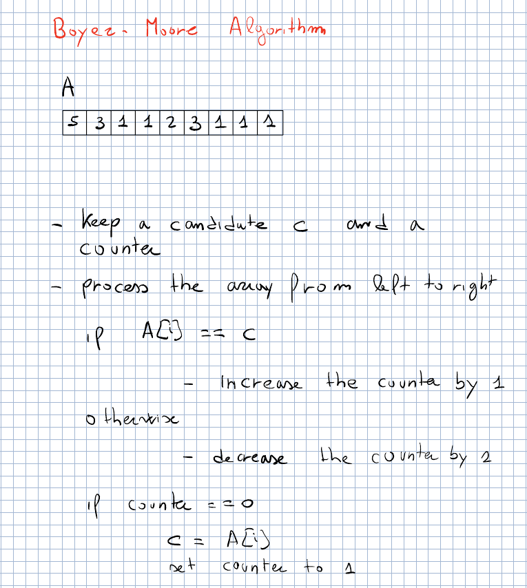
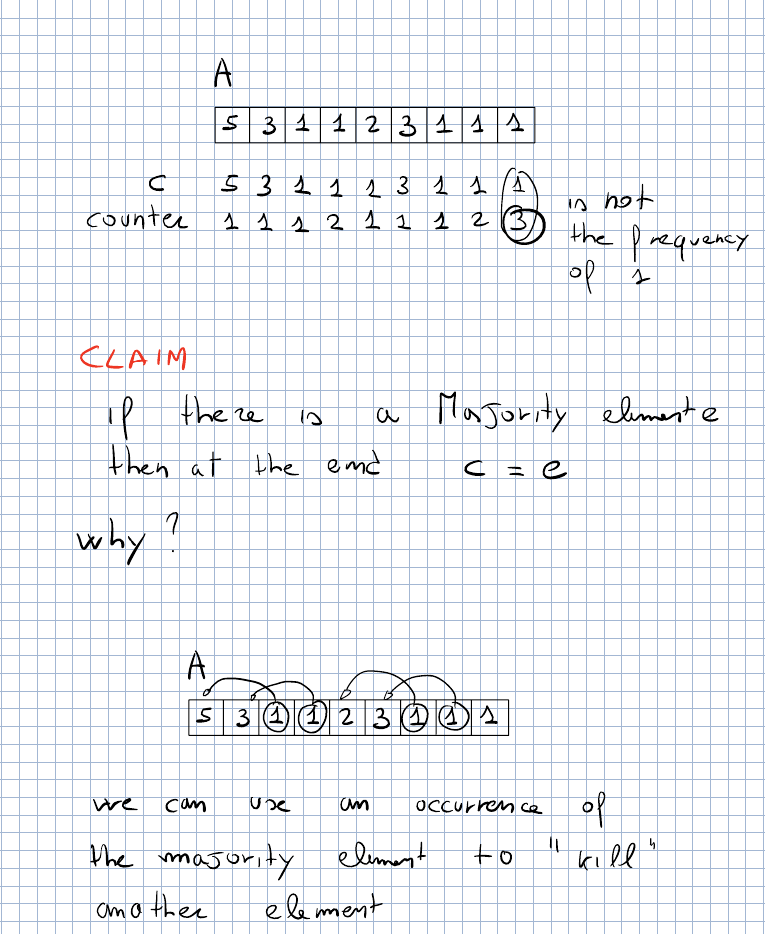
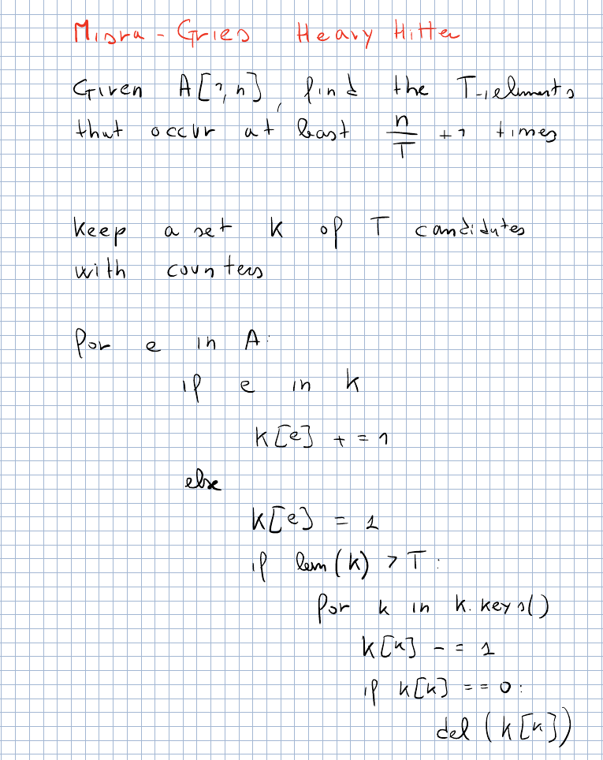

# CPC — Lecture 5 (PROVVISORIA)

Versione markdown di `L5.pdf` (in VS Code: anteprima con Cmd+Shift+V). Esercizi: `practice/`.

> **PROVISIONAL.** The recording of 30/09 is not available yet. This lecture is reconstructed from the professor’s notes of **last year** (`Pearls_2025.pdf` p. 8–17, in this folder): in 2025 these topics took the two “Tiny but Mighty” lectures right after the 100 prisoners puzzle, and so far 2026 has followed the 2025 schedule closely. What was really said on 30/09 may differ (in particular how the prof fixed the bug of the “destroy $A$” solution left as homework in L4): it will be redone on the recording.  
> **Previous**: L4 ended at “Does random access help? Destroying $A$” (`Lessons/L4/L4.pdf` §3.6).  
> **Next (L6, 05/10)**: in 2025 the next lecture was *binary search and the two pointers trick* (<https://pages.di.unipi.it/rossano/blog/2023/binarysearch/>).

Code: `Lessons/L5/src/lib.rs` — `cargo test -p l5`. Exercises: `Lessons/L5/practice` (`cargo test -p practice_l5`).

# Duplicate element: random access helps

## Destroying $A$, the 2025 way

\

\*Prof. notes of last year, Pearls_2025.pdf p.8\* View $A$ as a **linked list**: cell $i$ points to cell $A[i]$. Start from position $n$: no cell points to $n$ (all values are $<n$), so following the pointers we never come back to $n$; since there are finitely many cells we end up in a **cycle** ($\rho$ shape). The node where the tail enters the cycle has *two* incoming arrows (one from the tail, one from the cycle): two cells contain its index, i.e. **it is a duplicated value** (the “not possible” picture of the 100 prisoners, now possible because of the duplicate). Example: $8\to7\to4\to5\to2\to5$: we reach cell $5$ twice, $e=5$.

> Mark every visited cell (destroying $A$); the first cell reached twice is a duplicate. $\Theta(n)$ time, $O(1)$ extra space, but $A$ is destroyed.

`claude::follow_pointers_destroy` marks a cell by writing $n$ into it ($n$ is not a valid value). Note: the 2026 lecture attacked “destroy $A$” differently (reusing the MSBs, with a bug): how the prof fixed it on 30/09 is not in the 2025 notes.

## Floyd’s cycle finding: $A$ read-only, $O(1)$ space

\

\*Prof. notes of last year, Pearls_2025.pdf p.9\* Find the beginning of the cycle in $O(1)$ extra space without modifying the list:

- two pointers from the start: **S**low moves 1 step, **F**ast moves 2 steps;

- **phase 1**: they meet inside the cycle (this certifies that a cycle exists);

- **phase 2**: move F back to the beginning and set its speed to 1; “magic”: they meet again **at the beginning of the cycle**.

\

\*Prof. notes of last year, Pearls_2025.pdf p.10\* **Why.** When they meet, S has moved $m$ steps and F $2m$. With $a$ = length of the tail and $b$ = steps done by S inside the cycle, $m=a+b$, and F has done the same plus $k$ full loops of length $\ell$: $2m=a+b+k\ell$. Hence $2a+2b = a+b+k\ell$, i.e. $$a = k\ell - b.$$ In phase 2 F walks $a$ steps from the start and reaches the beginning of the cycle; in the same $a$ steps S, which was $b$ steps past the beginning, goes around to $b+k\ell-b \equiv 0$: the beginning of the cycle as well.

> Duplicate element with $A$ read-only: $\Theta(n)$ time, $O(1)$ extra space (random access needed). \[extra\] `claude::floyd`.

# Majority element

\

\*Prof. notes of last year, Pearls_2025.pdf p.12\* Given $A[1,n]$, find, if any, the element that occurs at least $\frac n2+1$ times. Sorting: $\Theta(n\log n)$ time; hash map: $\Theta(n)$ expected time, $\Theta(n)$ space. Is $\Theta(n)$ time and $O(1)$ space possible?

## Boyer–Moore algorithm

\

\*Prof. notes of last year, Pearls_2025.pdf p.13\* Keep a **candidate** $c$ and a **counter**; scan left to right: if $A[i]=c$ increase the counter, otherwise decrease it; if the counter becomes $0$, set $c=A[i]$ and the counter to $1$. \

\*Prof. notes of last year, Pearls_2025.pdf p.15\*

- Example $A=[5,3,1,1,2,3,1,1,1]$: at the end $c=1$, counter $3$. The counter is *not* the frequency of $1$ (which is $5$).

- **Claim**: if there is a majority element $e$, at the end $c=e$. **Why**: every decrement pairs one element with a different one and “kills” both; an occurrence of the majority element can kill another element, but there are more occurrences of $e$ than all the others together, so some occurrence of $e$ survives.

- If the majority is not guaranteed, $c$ can be anything (e.g. $[1,2,3]$): a second pass counting $c$ is needed. $\Theta(n)$ time, $O(1)$ space.

## Supporting insertions and deletions

\

\*Prof. notes of last year, Pearls_2025.pdf p.14\* With a dynamic set, Boyer–Moore does not work (it cannot undo). Idea: for each **bit position** keep how many elements have a $0$ and how many a $1$; the majority element is in the majority in *every* bit, so its $i$-th bit is the most frequent value in position $i$. In the example: bits give $001=1$; after deleting five $1$’s and inserting a $3$ the counts give $011=3$. $O(\log u)$ time per operation and $O(\log u)$ space, with $u$ the largest element. \[extra\] `claude::BitMajority`.

# Misra–Gries heavy hitters

\

\*Prof. notes of last year, Pearls_2025.pdf p.16\* Generalization: find the elements that occur at least $\frac nT+1$ times (at most $T$ of them). Keep a set $K$ of at most $T$ candidates with counters: for each $e$, if $e\in K$ increase its counter, otherwise insert it with counter $1$; if now $|K|>T$, decrease *all* counters and delete the zeros. \

\*Prof. notes of last year, Pearls_2025.pdf p.17\* **Running time**: the naive analysis gives $O(T\cdot n)$, but it is $\Theta(n)$: the total cost of the “decrease all” loops cannot exceed the number of elements of the array (each decrement cancels a previous increment, and there are $n$ increments). With $T=2$ it is exactly the majority element problem. \[extra\] Candidates may include false positives: a second pass to count them gives the exact answer (`claude::misra_gries`, `claude::heavy_hitters`).

# Puzzle: dominoes on a chessboard

Page 17 ends with a puzzle: an $8\times8$ chessboard with two **opposite corners removed**: can it be covered with dominoes ($2\times1$)? Think about it before reading the footnote.[^1]

[^1]: \[extra\] No: each domino covers one black and one white square, but the two removed corners have the same colour, so 30 squares of one colour and 32 of the other remain.
